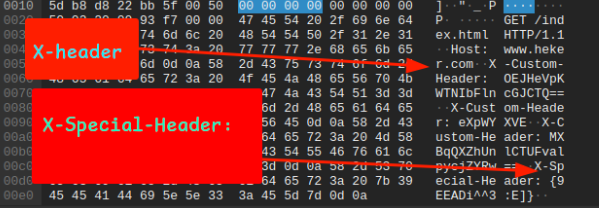
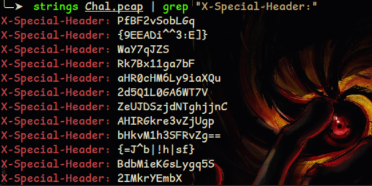

This challenge was made for the CTF which was organised by our team
**NCA@Nepal**. This challenge was a **Forensics challenge** where the players were given the **PCAP** file with the various images of clues and the scene behind the challenge.

Well, to solve this challenge players were needed to go through 2 challenge firstly, analyse the challenge which was given using **Wireshark** which will show us the packets. After launching the Wireshark and analyzing some of the packet we can see 2 kind of header, as the name says **( Xclusive headers )** there are something to
do with the headers.

There are 2 kind of headers
1- X-Header :
2- X-Special-Header:

So, there is something suspicious in both headers what needed to be done was players needed to do this `strings Chal.pcap | grep "X-Special-Header:" `
because as it says **Special** it will give output like this.

Well, there are many thing which is encoded in come kind of ciphers but there was really something suspicious in those ciphers those were this `{}`why there was 2 cipher code inside`{}`that was the suspicious part of the output. So, what should be doing that we need to decode that code inside the`{}` `9EEADi^^3:E]`&`=J^b|!h|sf`this code was encoded using the **ROT 47** so, we need to decode the code i prefer to use`https://gchq.github.io/CyberChef/`to decode the ciphers.

Note : **This is incomplete writeup of xclusive-headers will be add comeplete writeup soon thankyou.**
