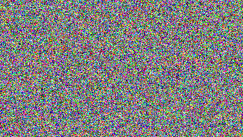
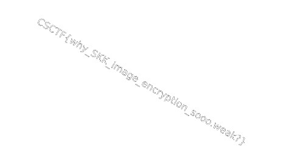

In this challenge by CyberSpace we were given a picture named enc.png and the python source code which was used to add shapes or used make the picture pixelated, the encoded picture looked like this.



The python code which was provided and the one which was used to encode this was this :

```
import numpy as np
import cv2
import random
from datetime import datetime

img = cv2.imread('flag.png')
size_x, size_y = img.shape[:2]

enc_negpos = np.zeros_like(img)

random.seed(datetime.now().timestamp())

for i in range(size_x):
    for j in range(size_y):
        for rgb in range(3):
            negpos = random.random()
            if negpos < 0.5:
                enc_negpos[i, j, rgb] = img[i, j, rgb]
            else:
                enc_negpos[i, j, rgb] = img[i, j, rgb] ^ 255


enc_shuffle = enc_negpos.copy()

for i in range(size_x):
    for j in range(size_y):
        shuffle = random.randint(1, 6)
        if shuffle == 1:
            enc_shuffle[i, j] = enc_negpos[i, j]
        elif shuffle == 2:
            enc_shuffle[i, j] = enc_negpos[i, j][[0, 2, 1]]
        elif shuffle == 3:
            enc_shuffle[i, j] = enc_negpos[i, j][[1, 0, 2]]
        elif shuffle == 4:
            enc_shuffle[i, j] = enc_negpos[i, j][[1, 2, 0]]
        elif shuffle == 5:
            enc_shuffle[i, j] = enc_negpos[i, j][[2, 0, 1]]
        else:
            enc_shuffle[i, j] = enc_negpos[i, j][[2, 1, 0]]


cv2.imwrite('enc.png', enc_shuffle)
```

At first what i thought was it was steganography so, i tried to use tools for that but it didn't worked so, what i did was read the code and get to know it was encoded by that code.
Then after, i thought it was supposed to meet the seed value for decoding but i wasn't.
To decode i make our favorite ChatGpt and it gave me the code to reverse it which was this.

```
import cv2
import numpy as np
import random

#Load the encrypted image
enc_img = cv2.imread('enc.png')
size_x, size_y = enc_img.shape[:2]

#Initialize the decrypted image
dec_img = np.zeros_like(enc_img)

#Function to reverse the shuffle based on the possible permutations
def reverse_shuffle(enc_pixel):
    # Possible permutations of RGB channels
    permutations = [
        [0, 1, 2], # No change
        [0, 2, 1],
        [1, 0, 2],
        [1, 2, 0],
        [2, 0, 1],
        [2, 1, 0]
    ]

    for perm in permutations:
        # Apply permutation
        permuted_pixel = enc_pixel[perm]
        # Reversing the shuffle permutation
        if (permuted_pixel[0] ^ permuted_pixel[1]) == (permuted_pixel[2] ^ permuted_pixel[1]):
            return permuted_pixel

    return enc_pixel # Return original if no match found (fallback)

#Reverse the shuffle
for i in range(size_x):
    for j in range(size_y):
        enc_pixel = enc_img[i, j]
        dec_pixel = reverse_shuffle(enc_pixel)
        dec_img[i, j] = dec_pixel

#Reverse the XOR operation
for i in range(size_x):
    for j in range(size_y):
        for rgb in range(3):
            if dec_img[i, j, rgb] < 128:
                dec_img[i, j, rgb] ^= 255

#Save the decrypted image
cv2.imwrite('flag.png', dec_img) #code for getting the real image
import cv2
import numpy as np
import random


enc_img = cv2.imread('enc.png')
size_x, size_y = enc_img.shape[:2]


dec_img = np.zeros_like(enc_img)


def reverse_shuffle(enc_pixel):
    permutations = [
        [0, 1, 2], # No change
        [0, 2, 1],
        [1, 0, 2],
        [1, 2, 0],
        [2, 0, 1],
        [2, 1, 0]
    ]

    for perm in permutations:

        permuted_pixel = enc_pixel[perm]

        if (permuted_pixel[0] ^ permuted_pixel[1]) == (permuted_pixel[2] ^ permuted_pixel[1]):
            return permuted_pixel

    return enc_pixel


for i in range(size_x):
    for j in range(size_y):
        enc_pixel = enc_img[i, j]
        dec_pixel = reverse_shuffle(enc_pixel)
        dec_img[i, j] = dec_pixel


for i in range(size_x):
    for j in range(size_y):
        for rgb in range(3):
            if dec_img[i, j, rgb] < 128:
                dec_img[i, j, rgb] ^= 255


cv2.imwrite('flag.png', dec_img)
```

and then used this code in the same directory where the enc.png was and it gave me the decoded image file named flag.png.



flag: CSCTF{why_SKK_image_encryption_sooo.weak}
