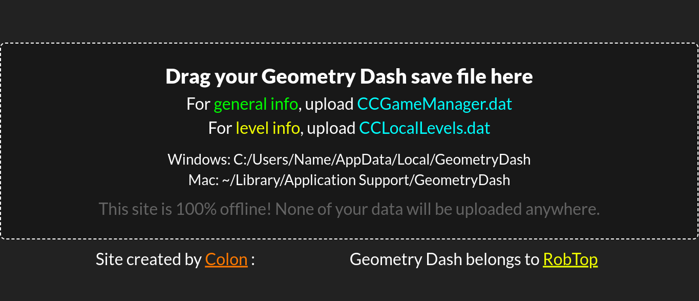
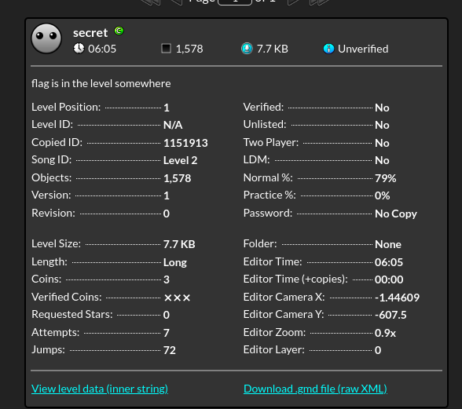
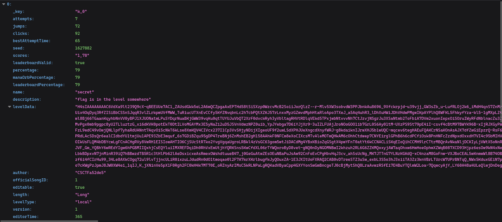
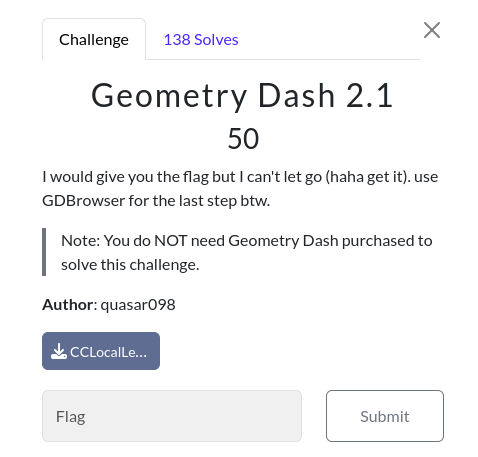
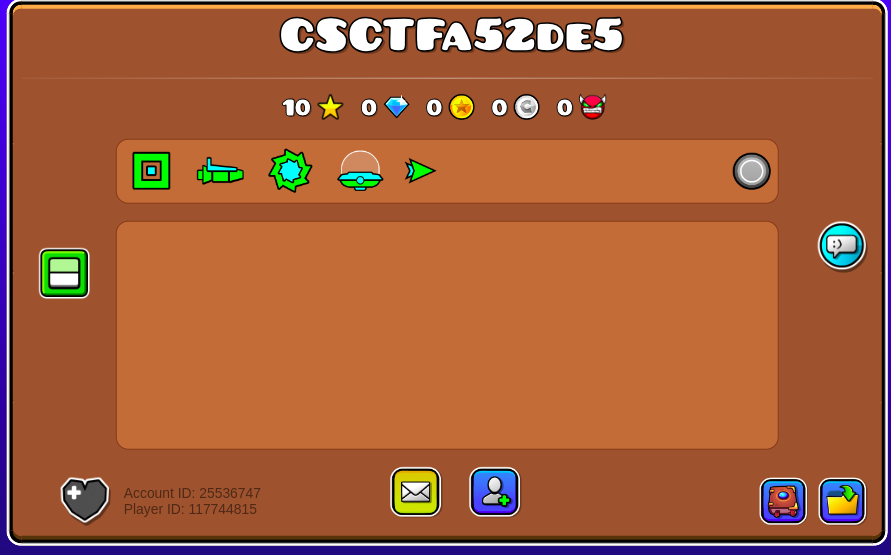
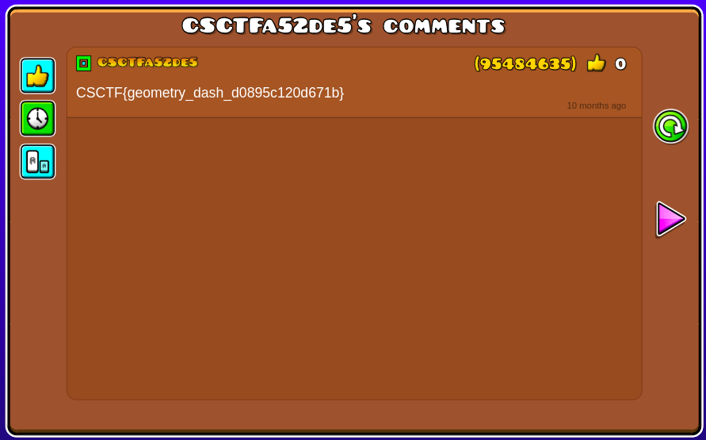

    This challenge was Forensics Category challenge in CyberSpace CTF 2024 in this challenge we were given a .DAT name ( cat CCLocalLevels.dat) file  which was the data of the Geometry Dash.

1. First cat the file then after i tired with the strings
2. Then i tried with the binwalk still didn't got anything

So, i google it to execute the .dat file which was provided by the author.

Then i found this link : https://gdcolon.com/gdsave/

So, after i uploaded the file what i got was this.

After that i downloaded the the file in JSON format, in the JSON file what i got was the author name on it.

Author name :- CSCTFa52de5

After getting the author's name what we were told that use GD Browser.

So, what i did was took the author name and pasted on GD browser and searched for the user i got this .

Then what i did was clicked in every buttons possible, after i clicked on that message/comment icon what i got was flag on there.

flag : CSCTF{geometry_dash_d0895c120d671b}
