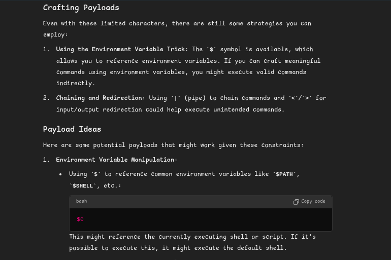
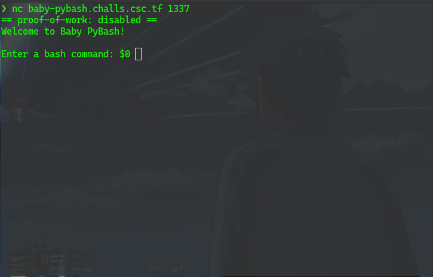
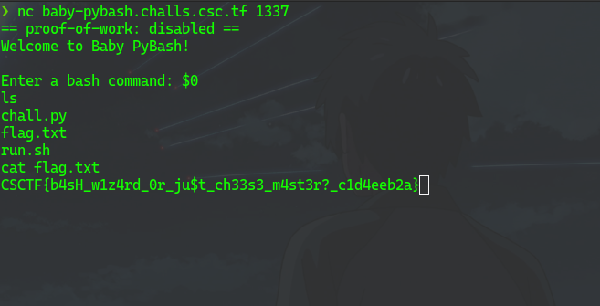

This challenge was beginner challenge in CyberSpace CTF 2024
in this challenge we need to bypass the bash shell which was created using the python
the challenge provided the the source code where `` [a-zA-Z*^\,,;\\!@/#?%`"\'&()-+]|[^\x00-\x7F] `` these character we forbid to use. So, as per the situation we have to bypass the bash shell so we need to send payloads for it. What i did was i prompt in the Chatgpt to give payloads for me to bypass the bash jail. Prompt : ` bash jail payload for this ctf challenge that only allows "<>.$|= as" and numbers`

after getting the payload, i used it what is does is that $0 expands to the name of the shell or shell script. This is set at shell initialization. If bash is invoked with a file of commands, $0 is set to the name of that file.

after using the payload it let me use the shell the way it is normally used and let me used all of the basic command of the bash shell.

after using `ls and cat flag.txt` command it gave me the flag.

`flag CSCTF{b4sH_w1z4rd_0r_ju$t_ch33s3_m4st3r?_c1d4eeb2a}`
